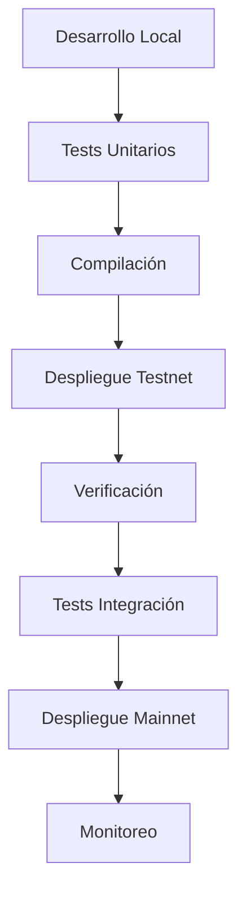

# ✅ Sistema de Contratos Médicos - Listo para Arbitrum

## 🎯 Resumen del Proyecto

Has configurado exitosamente un sistema completo de gestión de registros médicos basado en blockchain, optimizado para despliegue en **Arbitrum**. El sistema incluye tres contratos principales que trabajan de manera integrada:

### 📋 Contratos Implementados

1. **AccessControl.sol** - Control de acceso y permisos
2. **MedicalRecords.sol** - Gestión de documentos médicos
3. **AuditTrail.sol** - Registro de auditoría inmutable

### 🛠️ Herramientas de Desarrollo

- **Hardhat** - Framework de desarrollo
- **Scripts automatizados** - Despliegue, verificación e interacción
- **Tests completos** - Cobertura de funcionalidad
- **Documentación completa** - Guías y ejemplos

## 🚀 Inicio Rápido

### 1. Instalación Inicial

```bash
# Ejecuta el script de inicialización automática
npm run init
```

### 2. Configuración

```bash
# Edita el archivo .env con tus datos
cp .env.example .env
# Añade tu PRIVATE_KEY y ARBISCAN_API_KEY
```

### 3. Despliegue en Testnet

```bash
# Despliega en Arbitrum Sepolia (testnet)
npm run deploy:arbitrum-sepolia

# Verifica los contratos
npm run verify:arbitrum-sepolia
```

### 4. Interacción con Contratos

```bash
# Interactúa con los contratos desplegados
npm run interact:arbitrum-sepolia
```

## 📊 Ventajas de Arbitrum

### 💰 Costos Reducidos

- **~95% menos gas** que Ethereum mainnet
- Despliegue completo: **$1-5 USD** vs $100-500 USD en Ethereum

### ⚡ Mayor Velocidad

- **Confirmaciones instantáneas** (~1-2 segundos)
- **2,000+ TPS** vs 15 TPS en Ethereum

### 🔗 Compatibilidad Total

- **100% compatible** con herramientas de Ethereum
- **Sin cambios de código** necesarios
- **Mismo tooling** (Hardhat, MetaMask, etc.)

### 🌐 Infraestructura Robusta

- **Seguridad de Ethereum** L1
- **Descentralización** completa
- **Ecosistema maduro** con múltiples dApps

## 🏥 Funcionalidades del Sistema

### Para Pacientes 🏃‍♂️

- ✅ Control total sobre sus datos médicos
- ✅ Conceder/revocar acceso a doctores y seguros
- ✅ Historial completo de accesos
- ✅ Permisos con expiración temporal

### Para Doctores 👩‍⚕️

- ✅ Crear y actualizar registros médicos
- ✅ Acceso seguro con permisos del paciente
- ✅ Almacenamiento en IPFS (descentralizado)
- ✅ Historial de todas las acciones

### Para Seguros 🏢

- ✅ Acceso autorizado para procesamiento de reclamaciones
- ✅ Verificación automática de permisos
- ✅ Registro de auditoría de todas las consultas
- ✅ Integración con sistemas existentes

### Para Auditores 🔍

- ✅ Acceso completo a registros de auditoría
- ✅ Reportes de cumplimiento automatizados
- ✅ Detección de actividad sospechosa
- ✅ Verificación de integridad de datos

## 🔐 Características de Seguridad

- **🛡️ Control de acceso granular** - Permisos READ/WRITE/FULL
- **⏰ Expiración automática** - Accesos temporales
- **📝 Auditoría inmutable** - Registro permanente de actividades
- **🔍 Detección de anomalías** - Alertas automáticas
- **🔒 Encriptación off-chain** - Documentos seguros en IPFS

## 📈 Escalabilidad y Rendimiento

### Gas Optimizado

```
AccessControl:  ~500,000 gas
MedicalRecords: ~800,000 gas
AuditTrail:     ~1,000,000 gas
Total:          ~2,300,000 gas
```

### Arquitectura Eficiente

- **Datos mínimos on-chain** - Solo metadatos y hashes
- **Almacenamiento IPFS** - Documentos descentralizados
- **Eventos indexados** - Búsqueda eficiente
- **Batch operations** - Múltiples acciones en una transacción

## 🌍 Cumplimiento Normativo

### HIPAA (Estados Unidos)

- ✅ Registro de accesos
- ✅ Control de paciente
- ✅ Auditoría completa
- ✅ Seguridad de datos

### GDPR (Europa)

- ✅ Derecho de acceso
- ✅ Derecho de rectificación
- ✅ Derecho de supresión (soft delete)
- ✅ Portabilidad de datos

## 📁 Estructura del Proyecto

```
SmartContracts/
├── contracts/              # Contratos Solidity
│   ├── AccessControl.sol
│   ├── MedicalRecords.sol
│   ├── AuditTrail.sol
│   └── MedicalRecordsDeployer.sol
├── test/                   # Tests completos
├── scripts/                # Scripts de automatización
│   ├── deploy.js          # Despliegue
│   ├── verify.js          # Verificación
│   ├── interact.js        # Interacción
│   └── init.js            # Inicialización
├── deployments/           # Direcciones de contratos
├── hardhat.config.js      # Configuración Hardhat
├── .env.example          # Variables de entorno
└── docs/                 # Documentación completa
```

## 🔄 Workflow de Desarrollo



## 📞 Próximos Pasos

### Desarrollo Frontend

1. **Interfaz de Paciente** - Dashboard de control de accesos
2. **Portal Médico** - Gestión de registros
3. **Sistema de Seguros** - Procesamiento de reclamaciones
4. **Panel de Auditoría** - Reportes y compliance

### Integraciones

1. **IPFS** - Almacenamiento descentralizado
2. **ENS** - Nombres de dominio legibles
3. **The Graph** - Indexación de datos
4. **Chainlink** - Oráculos para datos externos

### Funcionalidades Avanzadas

1. **Multi-signature** - Operaciones críticas
2. **Governance** - Votación descentralizada
3. **Cross-chain** - Interoperabilidad
4. **NFTs médicos** - Certificaciones únicas

## 🎯 Casos de Uso Reales

### 🏥 Hospital Digital

- Pacientes controlan acceso a sus historiales
- Doctores colaboran con permisos específicos
- Seguros procesan reclamaciones automáticamente
- Auditores garantizan cumplimiento

### 🌐 Red de Clínicas

- Historiales médicos portables entre centros
- Permisos temporales para especialistas
- Integración con sistemas de laboratorio
- Reportes de calidad centralizados

### 🔬 Investigación Médica

- Datos anonimizados para estudios
- Consentimiento granular de pacientes
- Trazabilidad completa de uso de datos
- Cumplimiento ético automatizado

## 💡 Beneficios Clave

| Característica       | Antes            | Con Blockchain  |
| -------------------- | ---------------- | --------------- |
| **Control de Datos** | Hospital/Clínica | Paciente        |
| **Portabilidad**     | Limitada         | Total           |
| **Auditoría**        | Manual           | Automática      |
| **Costos**           | Altos            | Reducidos 95%   |
| **Velocidad**        | Días             | Segundos        |
| **Transparencia**    | Opaca            | Completa        |
| **Seguridad**        | Centralizada     | Descentralizada |

## 🚀 ¡Listo para Revolucionar la Medicina!

Tu sistema de registros médicos en Arbitrum está completamente configurado y listo para transformar la gestión de datos de salud. Con costos mínimos, velocidad máxima y seguridad garantizada, tienes todo lo necesario para crear la próxima generación de aplicaciones médicas descentralizadas.

### 🎉 ¡A desplegar se ha dicho!

```bash
npm run init
npm run deploy:arbitrum-sepolia
```

**¡El futuro de la medicina descentralizada comienza ahora!** 🏥⚡🚀
